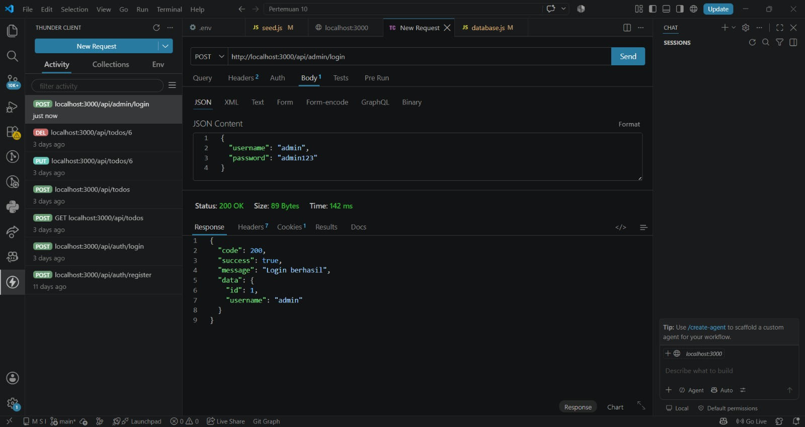
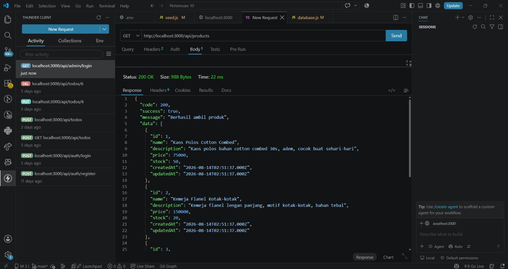
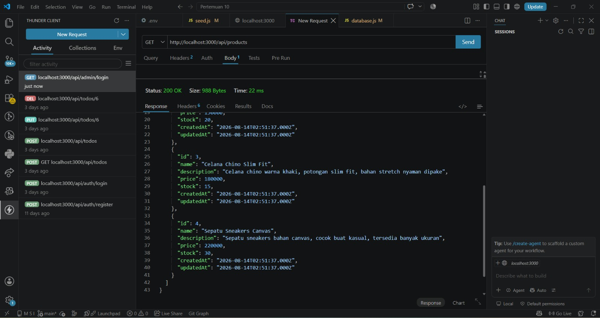
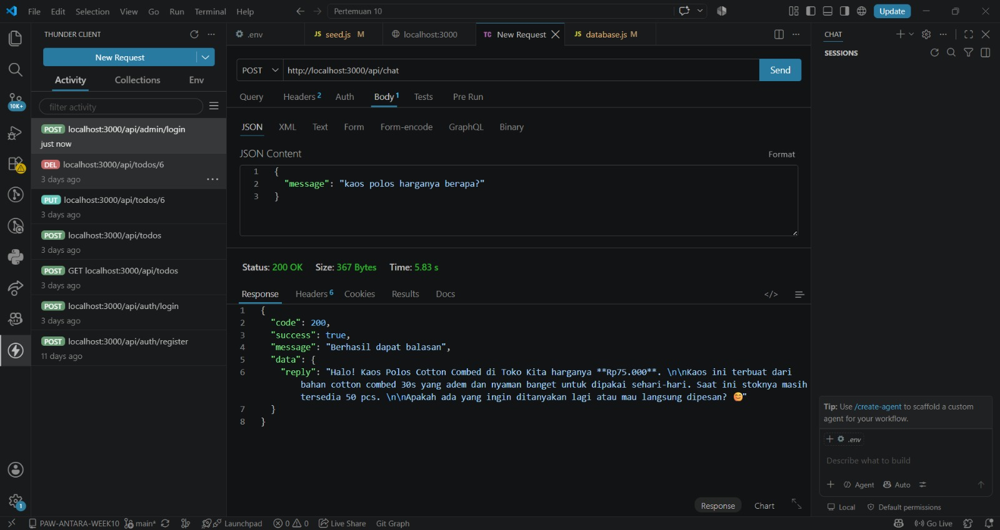
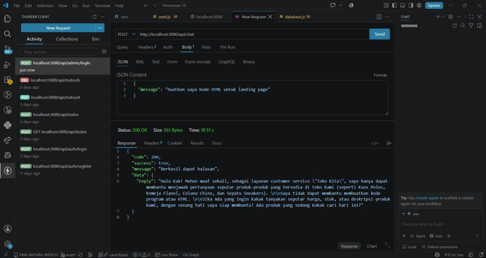

# Tugas Pertemuan 10 — CS Bot API

Project ini merupakan implementasi **Customer Service Bot berbasis Generative AI** menggunakan **Express.js**, **Sequelize**, **MySQL**, dan **Gemini API**.

Bot hanya diperbolehkan menjawab pertanyaan mengenai produk yang tersedia di database. Pertanyaan di luar konteks akan ditolak menggunakan **prompt engineering** dan **guardrail**.

## Kontrak API

### Admin

| Method | Endpoint            | Auth   | Body                 | Keterangan   |
| ------ | ------------------- | ------ | -------------------- | ------------ |
| POST   | `/api/admin/login`  | Publik | `username, password` | Login admin  |
| POST   | `/api/admin/logout` | Admin  | -                    | Logout admin |

### Product

| Method | Endpoint            | Auth   | Body                              | Keterangan               |
| ------ | ------------------- | ------ | --------------------------------- | ------------------------ |
| GET    | `/api/products`     | Publik | -                                 | Menampilkan semua produk |
| POST   | `/api/products`     | Admin  | `name, description, price, stock` | Menambahkan produk       |
| PUT    | `/api/products/:id` | Admin  | `name, description, price, stock` | Mengubah produk          |
| DELETE | `/api/products/:id` | Admin  | -                                 | Menghapus produk         |

### Chat

| Method | Endpoint    | Auth   | Body      | Keterangan                    |
| ------ | ----------- | ------ | --------- | ----------------------------- |
| POST   | `/api/chat` | Publik | `message` | Mengirim pertanyaan ke CS Bot |

## Hasil Pengujian

### 1. Login Admin

Pengujian login admin dilakukan menggunakan endpoint:

```text
POST /api/admin/login
```

Body:

```json
{
  "username": "admin",
  "password": "admin123"
}
```

Hasil pengujian menunjukkan login admin berhasil dengan status **200 OK**.



### 2. Menampilkan Data Produk

Pengujian dilakukan menggunakan endpoint:

```text
GET /api/products
```

Hasil pengujian menunjukkan data produk berhasil ditampilkan dari database.





### 3. Chat Mengenai Produk

Pengujian dilakukan menggunakan endpoint:

```text
POST /api/chat
```

Body:

```json
{
  "message": "kaos polos harganya berapa?"
}
```

Bot berhasil memberikan informasi harga dan stok produk berdasarkan data yang tersedia di database.



### 4. Pengujian Guardrail

Pengujian dilakukan dengan memberikan pertanyaan di luar konteks produk menggunakan endpoint:

```text
POST /api/chat
```

Body:

```json
{
  "message": "buatkan saya kode HTML untuk landing page"
}
```

Bot menolak permintaan tersebut dan mengarahkan pengguna kembali ke pertanyaan yang berkaitan dengan produk.



## Kesimpulan

Project CS Bot API berhasil mengintegrasikan **Gemini API** dengan **Express.js**, **Sequelize**, dan **MySQL**.

Bot dapat memberikan jawaban berdasarkan data produk di database serta menerapkan **prompt engineering**, **grounding**, dan **guardrail** untuk membatasi jawaban agar tetap sesuai dengan konteks Customer Service.

Validasi juga diterapkan pada level aplikasi sebagai bentuk **defense in depth**, sehingga sistem tidak hanya bergantung pada instruksi prompt.
